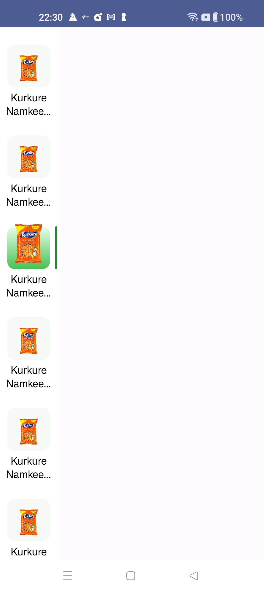

# MDVerticalTabLayout

This is the Vertical TabLayout Library where you can arrange items Vertically.  This Comes with a Floating Indicator and Animation 
.Also It automatically scrolls partially visible items to fully visible Area
Library Using Jetpack Compose as UI toolkit.
Note: As of Now we have a Tab Layout in Android Which is only Horizontal.

## Screenshots

## Features

- **Feature 1:** Indicator Height and Color Customisable.
- **Feature 2:** Indicator and Item Animation.
- **Feature 3:** Item Gradient Color Customisable .
- **Feature 4:** Text Customizable.

## Getting Started

To run this project locally, follow these steps:

Step 1. Add the JitPack repository to your build file

- Add it to your root build.gradle at the end of repositories:

<pre>

dependencyResolutionManagement {
		repositoriesMode.set(RepositoriesMode.FAIL_ON_PROJECT_REPOS)
		repositories {
			mavenCentral()
			maven { url 'https://jitpack.io' }
		}
	}
  
</pre>

- Add the dependency:
  
<pre>

dependencies {
	        implementation 'com.github.mohdDanishCode:MDVerticalTabLayout:0.8.0'
	}
  
</pre>

Step 2. Import MDVerticalTabLayout Library 

<pre>

@Composable
fun Example() {
    val categoryItemList: SnapshotStateList<CategoryItem> = remember {
        mutableStateListOf(
            CategoryItem(id = UUID.randomUUID().toString(), name = "Kurkure Namkeen - Masala Munch, 70 g", image = "https://www.bigbasket.com/media/uploads/p/xxl/102761_17-kurkure-namkeen-masala-munch.jpg"),
            CategoryItem(id = UUID.randomUUID().toString(), name = "Kurkure Namkeen - Masala Munch, 70 g", image = "https://www.bigbasket.com/media/uploads/p/xxl/102761_17-kurkure-namkeen-masala-munch.jpg"),
            CategoryItem(id = UUID.randomUUID().toString(), name = "Kurkure Namkeen - Masala Munch, 70 g", image = "https://www.bigbasket.com/media/uploads/p/xxl/102761_17-kurkure-namkeen-masala-munch.jpg"),
            CategoryItem(id = UUID.randomUUID().toString(), name = "Kurkure Namkeen - Masala Munch, 70 g", image = "https://www.bigbasket.com/media/uploads/p/xxl/102761_17-kurkure-namkeen-masala-munch.jpg"),
            CategoryItem(id = UUID.randomUUID().toString(), name = "Kurkure Namkeen - Masala Munch, 70 g", image = "https://www.bigbasket.com/media/uploads/p/xxl/102761_17-kurkure-namkeen-masala-munch.jpg"),
            CategoryItem(id = UUID.randomUUID().toString(), name = "Kurkure Namkeen - Masala Munch, 70 g", image = "https://www.bigbasket.com/media/uploads/p/xxl/102761_17-kurkure-namkeen-masala-munch.jpg"),
            CategoryItem(id = UUID.randomUUID().toString(), name = "Kurkure Namkeen - Masala Munch, 70 g", image = "https://www.bigbasket.com/media/uploads/p/xxl/102761_17-kurkure-namkeen-masala-munch.jpg"),

        )
    }

    Box(
        modifier = Modifier.fillMaxSize(),
    ) {
        MDVerticalTabLayout(
            list = categoryItemList,
            indicatorColor = Color(0xFF2C8335),
            gradientFirstColor = Color(0xFFE9FFEB),
            gradientSecondColor = Color(0xFF47C253),
        ) {categoryItem->
        }
    }
}
  
</pre>

## Contributing

We welcome contributions! Here's how you can contribute:

1. Fork the repository.
2. Create a new branch for your feature (`git checkout -b feature-name`).
3. Commit your changes (`git commit -m 'Add some feature'`).
4. Push to the branch (`git push origin feature-name`).
5. Open a pull request.

  

